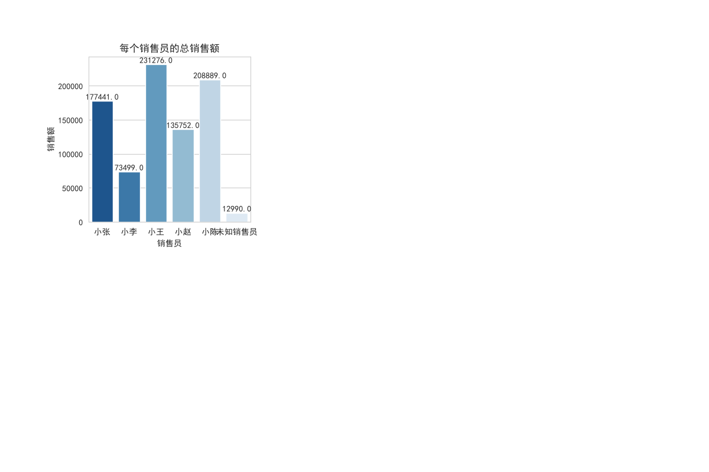
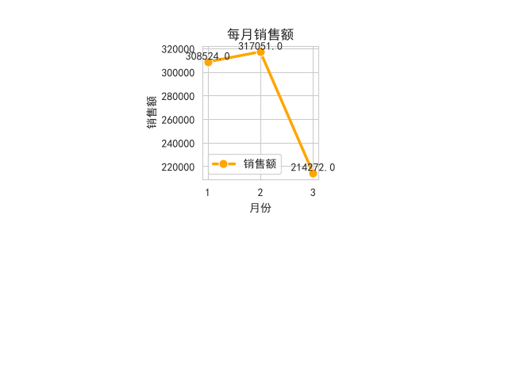
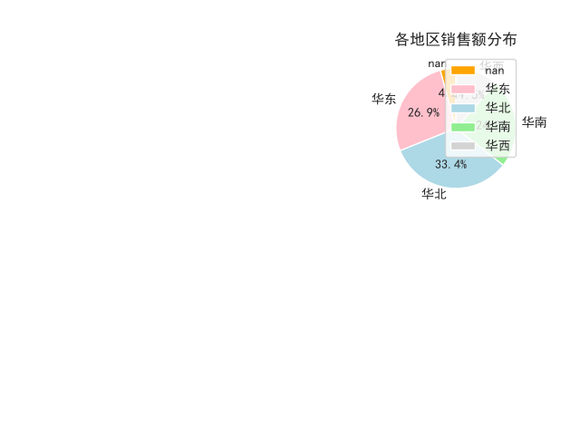
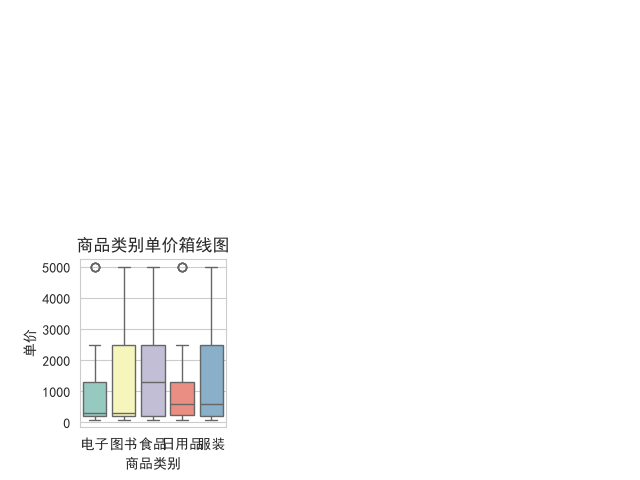
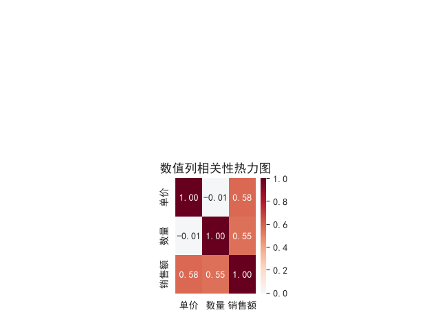
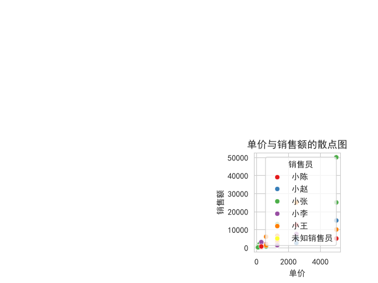
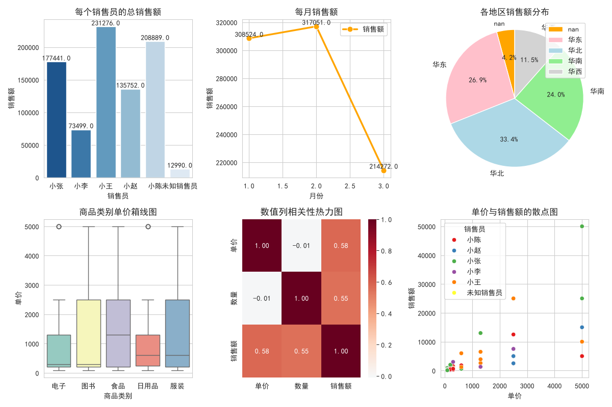

# 电商销售数据分析报告

📊 基于 2024 年上半年 200 条电商订单数据，使用 Python + Pandas + Matplotlib + Seaborn 完成的完整数据分析项目。

## 📁 项目文件

| 文件 | 说明 |
|------|------|
| `电商销售分析.ipynb` | 完整的数据清洗、分析、可视化代码 |

## 🔧 技术栈

- **Python 3.x**
- **Pandas** — 数据清洗与分析
- **Matplotlib** — 基础可视化
- **Seaborn** — 高级统计可视化

## 📈 分析内容

1. **数据清洗** — 缺失值填补、异常值修正（负数/离谱值）
2. **统计分析** — 销售员排名、地区分布、月度趋势、商品类别分析
3. **数据可视化** — 柱状图、折线图、饼图、箱线图、热力图、散点图
4. **业务洞察** — 销售冠军、核心区域、价格异常、相关性分析

## 🎯 核心结论

- 小王以 23.1 万元总销售额位居第一
- 华北区贡献 33.4% 销售额，是核心营收区域
- 3 月销售额环比下降 32%，需关注
- 单价与销售额相关系数 0.58，提升单价是有效策略

## 📊 可视化结果

### 1. 销售员总销售额对比

### 2. 月度销售趋势

### 3. 各地区销售额占比

### 4. 商品类别单价分布

### 5. 数值相关性分析

### 6. 单价与销售额关系

### 综合分析看板

## 👤 作者

- GitHub: [@mszy212](https://github.com/mszy212)
- 数据分析师（学习中）

---

> ⭐ 如果这个项目对你有帮助，欢迎 Star！
